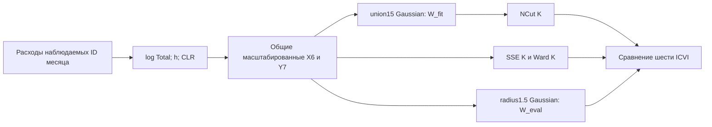

# Методология месячной сети и контекстных профилей

**Зафиксированный результат на 8 октября 2026 года:** основной месячный слой — NCut10 на наблюдаемых ID каждого месяца 2023–2024 годов; SSE10 обязателен как сильный контроль в той же геометрии. NCut20 остаётся исследовательским разрешением. Годовые context6 KMeans6 — отдельные описательные профили на более узкой опоре. Это выбор рабочих ролей, а не универсальная победа одного алгоритма.

Документ раскрывает C1–C4: понятную методологию, атрибуты и рёбра, сравнение определений сходства и шесть ICVI. Числа взяты из принятых сохранённых результатов. Новое обучение и полный пересчёт ICVI при подготовке документа не выполнялись. Перечень фактически использованных файлов и SHA-256 находится в SOURCE_INDEX.json; статус подготовки — в receipt.json. Текст условий используется в сохранённой локальной редакции, без заявления о новой проверке сайта организатора.

## 1. Что измеряется и на какой опоре

Исходный показатель — модельная оценка средних безналичных потребительских расходов **жителей** МО в текущем месяце, в рублях. Он не измеряет непосредственно оборот торговли внутри территории, все доходы жителей или производственную специализацию. Региональные ценовые различия могут влиять на уровень; дополнительная дефляция в данной геометрии не выполняется.

В месячном массиве порядок шести осей закреплён принятой семантической схемой:

1. Total — физическая категория «Все категории»;
2. Продовольствие;
3. Здоровье;
4. Общественное питание;
5. Транспорт;
6. Маркетплейсы.

Пять выбранных категорий не исчерпывают Total. Их нормировка на собственную сумму описывает состав **выбранной пятёрки**, а не доли всех расходов. Остаточная шестая расходная категория не изобретается. Нельзя переносить старые подписи осей на числа после семантического исправления.

Каталог содержит 2190 ID; за 24 месяца наблюдаются 50521 пары ID–месяц. В каждом месяце используются именно имеющиеся положительные полные шестимерные наблюдения, без подстановки нулей за отсутствующие МО и без требования полной 24-месячной истории. ID — идентификатор поставщика, а не автоматически ОКТМО. Совпадение номера группы между месяцами не устанавливает её постоянную идентичность.

| Панель | Период и опора | Сохранённый объём | Пространство оценки |
| --- | --- | --- | --- |
| DT24-MIXED-GRID-v1 | 24 месяца; исходные наблюдаемые ID месяца | 3 алгоритма ×7 значений K ×24 =504 разбиения | Одна mixed-геометрия и один общий оценочный граф на месяц |
| Проверка устойчивости DT24 | 2023-03/06/09 и 2024-03/06/09;10 выборок по 80% на месяц | Только K10/K20, отдельно от полной сетки | End-to-end: масштабы переоцениваются на выбранных ID |
| Годовой контекст | 2024;1666 условно допущенных ID, 69 регионов | 2 геометрии ×2 алгоритма ×7 K =28 разбиений | Собственная геометрия каждой годовой панели |
| Поздние GRAPH2/U30/SHAPE | 2024-03/06/09/12;2 выборки по 80% на месяц | Ограниченные проверки гипотез | Исходные полные масштабы фиксированы; это другой протокол |

Полная месячная сетка: K=4, 6, 8, 10, 12, 16, 20, алгоритмы SSE, Ward, NCut. Все 504 разбиения сохранены, включая результаты с неопределённым отдельным ICVI. Старые K2-проверки используются только как исторические сравнения сходства; пилот real64 не характеризует национальный результат.

## 2. Атрибуты: уровень, относительный охват и состав

Для одного МО обозначим Total через T, пять выбранных расходов через c₁…c₅. Во всех используемых наблюдениях значения положительны; берётся натуральный логарифм. Пусть

\[
L=\log T,\qquad m=\tfrac15\sum_{j=1}^5\log c_j,\qquad
h=m-L,\qquad \operatorname{clr}_j=\log c_j-m.
\]

**L** отвечает за общий уровень расходов. **h** сравнивает геометрическое среднее выбранных категорий с Total: h=log(GM(c)/T). Это относительный показатель, а не бухгалтерская доля их суммы в Total. **CLR** описывает соотношения категорий: увеличение всех пяти c в одинаковое число раз сохраняет CLR. У CLR пять координат с нулевой суммой; для расчётов используется четырёхмерная ортонормированная система Helmert:

\[
R=H\operatorname{clr}/\sqrt5,\quad HH^\top=I_4,\quad H\mathbf1=0.
\]

В строке k=1…4 матрицы H первые k элементов равны 1/√(k(k+1)), следующий равен −k/√(k(k+1)), остальные нули. Поэтому расстояние R равно CLR-расстоянию, делённому на √5. Базис не добавляет новый экономический признак.

Каждый блок нормируется по сохранённому масштабу s: сначала медиана расстояний всех неупорядоченных пар внутри каждого месяца, затем медиана 24 месячных медиан. Для принятого полного набора:

| Блок | Масштаб |
| --- | ---: |
| L | 0.2928238502237921 |
| h | 0.15259702900114225 |
| R | 0.39785463071189964 |

При α=β=0.5 шестимерные координаты и расстояние имеют вид

\[
X=\left[\frac{\sqrt{0.5}L}{s_L},\frac{0.5h}{s_h},\frac{0.5R}{s_R}\right],
\qquad
d^2(i,j)=0.5\frac{\Delta L^2}{s_L^2}+0.25\frac{\Delta h^2}{s_h^2}+0.25\frac{\|\Delta R\|^2}{s_R^2}.
\]

Номинальные веса 0.5/0.25/0.25 задают баланс блоков после масштабирования. Они не означают равный вклад блоков в каждую пару, статистическую независимость или вероятности причин. Масштабы полной календарной сетки фиксированы и ретроспективны: использование всех 24 месяцев не является протоколом прогноза, доступного на начало каждого месяца.

Для S_Dbw используются симметричные семимерные координаты

\[
Y=\left[\frac{\sqrt{0.5}L}{s_L},\frac{0.5h}{s_h},\frac{0.5\operatorname{clr}}{\sqrt5s_R}\right].
\]

Y и X сохраняют одинаковые попарные евклидовы расстояния, но S_Dbw содержит норму вектора покоординатных дисперсий. Поэтому конкретное симметричное представление Y7 является частью определения метрики. Дополнительной нормировки отдельных осей перед S_Dbw нет.

## 3. Что означает ребро

В каждом месяце строится неориентированная сеть сходства расходов. Для NCut применяется **union-kNN15**: связь i–j включается, если j входит в 15 ближайших соседей i **или** i входит в 15 ближайших соседей j. Все точные равенства на 15-м расстоянии сохраняются, поэтому степень вершины не обязана равняться 15. Петли исключены; разные ID с нулевым расстоянием остаются разными вершинами.

Вес включённого ребра:

\[
w_{ij}=\exp\{-d^2(i,j)/(2\sigma^2)\},\quad\sigma=1,\quad w_{ii}=0.
\]

Это **W_fit**, граф для поиска сетевого разбиения. Для сопоставимой оценки всех трёх алгоритмов отдельно используется **W_eval**: те же Gaussian-веса на парах с d≤1.5. Общая матрица W_eval одинакова для SSE, Ward и NCut в данном месяце. Условия включения рёбер и равенства проверяются по точным dyadic-представлениям исходных binary64-координат; округлённая картинка не определяет поддержку графа.

Ребро означает близость измеренных профилей расходов при данной нормировке. Оно не доказывает географическое соседство, поездку, денежный поток, хозяйственную зависимость или причинное влияние. Изменение правил W_fit меняет задачу NCut; её собственное значение целевой функции нельзя прямо ранжировать между разными графами.

## 4. Алгоритмы разбиения при фиксированном сходстве

| Алгоритм | Оптимизируемая величина и реализация | Что из результата не следует |
| --- | --- | --- |
| SSE | Минимизация ∑g∑i∈Cg‖Xᵢ−μg‖²; Lloyd с D²-инициализацией и PCG64 | Не гарантирован глобальный минимум; граф для fit не используется |
| Ward | Последовательное объединение с наименьшим приростом SSE; scipy linkage ward/euclidean и cut_tree | Иерархическое локальное решение, а не независимый глобальный оптимум каждого K |
| NCut | Минимизация ∑g cut_fit(Cg,¬Cg)/vol_fit(Cg); спектральная релаксация и дискретизация Lloyd | Получена приближённая дискретизация, а не доказанный глобальный минимум исходного NCut |

NCut использует L_sym=I−D⁻¹ᐟ²W_fitD⁻¹ᐟ², первые K собственных векторов и нормировку их строк. Допуск проверяет положительность сил вершин, число компонент, разрыв между K-м и следующим собственным значением, невязку, ортогональность и нормы строк. Неуспех проверки сохраняется отдельным статусом; скрытого восстановления графа нет.

SSE и спектральная дискретизация используют восемь фиксированных seed: 1000003, 1104732, 1209461, 1314190, 1418919, 1523648, 1628377, 1733106; предел Lloyd300 итераций. Представитель выбирается **по собственной целевой функции**, среди сошедшихся запусков: для SSE это SSE, для NCut — дискретный NCut на W_fit. В допуске τ=scale/10¹⁰ применяется лексикографический порядок канонических меток, затем номер seed; scale=max(1, SST) для SSE и K для NCut. Представитель не выбирается по лучшему SW. Ward строит одно детерминированное дерево на месяц; восемь seed к нему неприменимы. Срезы дерева Ward вложены, разные K у NCut такой гарантии не имеют.

## 5. Сравнение именно определений сходства — C3

Сравнение SSE/Ward/NCut при одном X решает вопрос об алгоритме разбиения. Критерий C3 дополнительно требует сравнения способов определить близость территорий. Для этого сведены **27 строк** в SIMILARITY_COMPARISON.csv. В каждой указаны K, период, опора, пространство fit/evaluation, доступность и протокол устойчивости. Единая таблица не создаёт общего рейтинга между разными протоколами.

| Изменение определения | Что проверено | Обоснованный вывод |
| --- | --- | --- |
| Mixed против только L и только CLR | Исторический I26: 24 месяца, K2, общий mixed-evaluator | Проверен вклад уровня и состава; это не непосредственное доказательство выбора K10 |
| Косинус расходов | E27: два декабря, K2; cosine положительных исходных пяти RUB-категорий, union15, вес=cosine | SW в общем mixed-пространстве ≈0.1383/0.1909; вариант отвечает иной мере сходства, превосходство для текущей задачи не показано |
| α=0.25; union10/20; полный и радиусный графы | Ранние проверки K2 с явно указанным охватом | Чувствительность существует; лучший исторический показатель нельзя переносить на K10 |
| Mutual15 вместо union15 | GRAPH2: четыре квартальных месяца, K10/20, два draw | Все 24 зарегистрированные кандидатные ячейки недоступны из-за изолированных вершин без repair; это отсутствие разбиения, а не нулевой ICVI |
| Локальная шкала rho7 | Тот же GRAPH2; вес exp(−d²/(rhoᵢrhoⱼ)), rhoᵢ=расстояние до 7-го соседа | Совместный quality gate не пройден; среднее улучшение отдельного индекса K20 не отменяет ухудшений устойчивости и худшего месяца |
| Union30 | Четыре квартальных месяца, K10/20, два draw, фиксированный reference | K10 macro-J0.7898 против 0.8339 у union15; K20 macro-J0.6274 против 0.6117, но совместный gate провален по качеству; расширение не принято |
| CLR4 без L и h | SHAPE: четыре квартальных месяца, K10, NCut и SSE, два draw | В общем mixed-evaluator SW≈0.0131/0.0692 против 0.2356/0.2620 у mixed; mean macro-J и ARI ниже; оба gate провалены |

Для исходного cosine используется cos(cᵢ, cⱼ)=(cᵢ·cⱼ)/(‖cᵢ‖‖cⱼ‖), без Total. Это масштабно инвариантная мера состава исходных пяти расходов; она отличается от логарифмических отношений CLR. Соседи выбираются по точному рангу cosine с сохранением всех граничных равенств; вес ребра равен cosine, а не Gaussian.

**Зависимость от пространства оценки раскрыта отдельно.** В принятом cross-geometry аудите тех же старых K2-разбиений shape-контроль проигрывает SW всем четырём контролям 24/24 раза в mixed-геометрии и выигрывает 24/24 в shape-геометрии. Сравнение выполняется внутри каждого evaluator; сырые значения разных геометрий не вычитаются. Общий mixed-evaluator обоснован вопросом о совместном сходстве уровня и состава расходов, но не доказывает универсальную бесполезность shape. Также удаление L и h не доказывает независимость оставшегося состава от благосостояния.

Исторический радиусный вариант имеет неполное назначение в 2023-09: 2108 из 2109 наблюдаемых ID, изолирован ID 344. Его конечные значения на частичной опоре не ставятся в один ряд с полными национальными разбиениями. В текущей DT24-сетке все 504 разбиения сохранены на полной наблюдаемой опоре месяца.

## 6. Шесть ICVI: точные соглашения, направления и статусы — C4

Для геометрических индексов задана одна опора и X/Y; для сетевых — общий W_eval. Никакие undefined не заменяются нулями. Следующие формулы описывают **реализованные проектные соглашения**. Организатор перечисляет SW, CH, S_Dbw, AVI, AVU, MQ, но сохранённый текст условий не устанавливает единственную формулу AVI/AVU/MQ. MQ здесь — weighted Newman modularity при γ=1; отдельное подтверждение этой формулы организатором отсутствует.

### SW — больше лучше

Для объекта i aᵢ — среднее евклидово расстояние до других объектов своей группы, bᵢ — наименьшее среднее расстояние до другой группы:

\[
s_i=(b_i-a_i)/\max(a_i,b_i),\qquad SW=N^{-1}\sum_i s_i.
\]

Singleton получает 0; при a=b=0 берётся 0; одна группа означает undefined. Отрицательный SW указывает на геометрическую пограничность в выбранном пространстве, а не на вероятность ошибки. Основной SW — среднее по объектам внутри месяца; календарный показатель — равновзвешенное среднее 24 месячных SW. Групповой macro-SW является другой диагностикой и не подменяет основной индекс.

### CH — больше лучше

\[
CH=\frac{SSB/(K-1)}{SSW/(N-K)},\quad
SSW=\sum_g\sum_{i\in C_g}\|X_i-\mu_g\|^2,\quad SSB=SST-SSW.
\]

Требуется 1<K<N. При SSW=0 и SSB>0 сохраняется positive_infinity; при 0/0 — undefined. Отрицательная точная SSB — numerical_failure. Центрированные суммы и их разложение вычисляются без приблизительного вычитания больших округлённых величин. Связь CH с SSE структурная, поэтому высокий CH у SSE сам по себе не является независимой внешней проверкой.

### S_Dbw — меньше лучше

В симметричном Y7 v_g — вектор **популяционных покоординатных дисперсий** группы, v — такой же вектор всей опоры:

\[
Scat=\frac1K\sum_g\frac{\|v_g\|_2}{\|v\|_2},\qquad
\rho=\frac{\sqrt{\sum_g\|v_g\|_2}}K.
\]

Для каждой пары g<h плотности считаются только на пуле Cg∪Ch в **замкнутых** шарах радиусаρ вокруг μg,μh и их середины. Пусть n_g, n_h, n_mid — эти три числа; тогда

\[
Dens_{bw}=\frac2{K(K-1)}\sum_{g<h}\frac{n_{mid}}{\max(n_g,n_h)},\quad S\_Dbw=Scat+Dens_{bw}.
\]

Если знаменатель пары 0 ичислитель 0, пара undefined; при положительном числителе и нулевом знаменателе — positive_infinity. Любая undefined-пара делает весь индекс undefined; иначе наличие бесконечной пары даёт positive_infinity. Одна группа или нулевая общая дисперсия также дают undefined. Счётчики и радиус сохранены в диагностике. Добавлениеε, замена 0/0 нулём, увеличение радиуса или скрытая нормировка осей изменили бы индекс и здесь не выполняются.

В принятой DT24-сетке **175 ячеек finite/ok, 329 undefined; итоговых positive_infinity-ячеек нет**. Причина 329 — нулевые знаменатели плотностей отдельных пар. При большом K единый радиус может оказаться слишком мал для точек около центроидов; это свойство данного определения, не оценка качества 0 и не автоматическая ошибка исполнения. Конечность S_Dbw на старом K2 не исправляет undefined текущего K10. В SHAPE-пилоте все 24 новых S_Dbw конечны, но оба совместных gate всё равно провалены.

### Общие обозначения сетевых индексов

На W_eval определим I_g=∑i, j∈Cg wᵢⱼ — внутренний вес **с двойным учётом** неориентированных рёбер; E_g=∑i∈Cg, j∉Cg wᵢⱼ — внешний вес; vol_g=I_g+E_g; C_gh=∑i∈Cg, j∈Ch wᵢⱼ; m=½∑i, jwᵢⱼ. Эти соглашения исключают неоднозначность множителя 2.

### AVI — больше лучше

\[
AVI=\frac1K\sum_g\frac{I_g}{I_g+E_g}.
\]

Показывает среднюю долю внутренней силы групп. Нулевой объём хотя бы одной группы даёт undefined. Все группы имеют равный вес в этом среднем независимо от размера.

### AVU — меньше лучше

\[
AVU=\frac2K\sum_{g<h}\frac{C_{gh}}{E_g+E_h-C_{gh}}.
\]

Для полностью закрытой пары 0/0 проектная операционная конвенция задаёт вклад 0, одновременно сохраняя strict_literal_status=undefined и число таких пар. Это явное соглашение, а не скрытая обработка пропуска. При K2 и положительном межгрупповом весе AVU тождественно 1; при K3 и положительном суммарном межгрупповом весе —2/3. Поэтому AVU не различает методы в этих случаях. Его абсолютные значения между разными K не используются для выбора разрешения.

### MQ — больше лучше

\[
MQ=\sum_g\left[\frac{I_g}{2m}-\left(\frac{vol_g}{2m}\right)^2\right],\quad\gamma=1.
\]

Это отличие внутреннего веса от нулевой модели, сохраняющей силы вершин. Нулевая масса графа даёт undefined. Значение зависит от оценочного графа и разрешения; более высокий MQ не устанавливает экономическую истинность типов. Название Modularity Quality из условий не означает, что организатор отдельно подтвердил именно данную формулу.

### Как читать итоговую таблицу

METRICS_COMPARISON.csv содержит **238 строк**: 126 сочетаний «алгоритм ×K ×шесть ICVI» месячной сетки и 112 значений «28 годовых разбиений ×четыре их собственных индекса». Для каждой строки указаны число зарегистрированных и конечных наблюдений, причины undefined, направление, среднее, медиана, диапазон и SHA источника. Национальные 3024 индивидуальные значения со статусами остаются в исходном metric_availability.csv; новая таблица — их сводка, а не подмена исходных результатов.

У всех 504 месячных разбиений конечны SW, CH, AVI, AVU, MQ. Для S_Dbw среднее только по finite-месяцам всегда сопровождается знаменателем. Например, NCut10 имеет 2/24 finite, Ward10 —1/24, SSE10 —0/24; сравнивать первые два среднего как одинаковую 24-месячную проверку нельзя.

Исходный внутренний all-six-finite gate сохраняется: у выбранного NCut10 лишь 2 месяца помечены eligible в этом строгом смысле. Выбор описательного слоя не переписывает 22 остальных флага. Требование представить все шесть ICVI не тождественно требованию организатора получить конечность всех шести в каждом месяце. Общего взвешенного балла или «победы по шести индексам» не конструируется.

## 7. Выбор K10 с видимым контролем

По 24 месяцам SW у NCut10=0.2179, у SSE10=0.2582. Отрицательных объектных SW7021/50521 против 2504/50521; у SSE также выше CH, AVI, MQ и ниже AVU. По шестимесячной end-to-end проверке NCut10 имеет более высокие средние macro-J/ARI: 0.7470/0.7519 против 0.7177/0.7040 у SSE10. Однако худший месяц macro-J у NCut10=0.5613 против 0.6456 у SSE10; минимальный средний J отдельной группы NCut10≈0.2476.

У NCut20 средний macro-J=0.6310 и 23/120 проверенных полных групп имеют средний J<0.5; у NCut10 —5/60. Этот порог описательный. K10 выбран как более воспроизводимое в среднем подробное сетевое разрешение, с обязательным раскрытием слабого хвоста и контроля. Высокий SW более крупных K4/K6 и отсутствие их end-to-end проверки не позволяют заявлять доказанный оптимум K10 по всей сетке. Полные числовые таблицы и все ограничения приведены в K_SELECTION.md.

## 8. Годовой контекст — отдельная постановка

context6 содержит шесть блоков с весами 1/6: типичный уровень расходов; CLR-состав выбранной пятёрки; население на 01.01.2024; market_access; зарплата работников охваченных организаций; структура охваченных организаций. Последний блок включает работников организаций на жителя и долю образования среди работников этих организаций. Показатели не равны доходу всех жителей, занятости по месту проживания или бюджетной доле. Население, доступность и интенсивность взаимосвязаны; блоки не независимы.

Расходные годовые координаты — средние 12 месячных логарифмов и CLR, поэтому экспонента среднего log Total — геометрическое среднее месячного уровня, не годовая сумма. Дополнительные координаты: log населения, log1p доступа, log зарплаты, log1p работников на жителя, arcsin√доли образования. В двухмерном блоке организаций применяется IQR-нормировка; блоки медианно центрируются и масштабируются через корень медианы квадратов попарных расстояний. Нулевой масштаб — явный отказ, без удаления блока. Схема и порядок осей годовой матрицы собственные; на неё нельзя механически переносить месячные индексы столбцов.

На тех же 1666 ID сравнивается spending2: только уровень и состав с весами 1/2. Ward и KMeans проверены при семи K, всего 28 разбиений. KMeans использует восемь фиксированных стартов, n_init=1 на старт, max_iter300, tol1e−6, выбор по валидной минимальной inertia. Годовые собственные индексы — SW, CH, Davies–Bouldin и inertia. Для этих 28 разбиений шесть сетевых ICVI не объявляются рассчитанными; собственного сетевого графа эта постановка не задаёт. Числа context6 и spending2 на их разных геометриях не образуют прямого рейтинга.

Выбранная годовая роль — context6 KMeans6. Она не является национальной месячной K6, родителем NCut10 или независимой внешней проверкой расходных групп: контекстные признаки участвовали в fit. Опора 1666 условно допущенных ID из 69 регионов уже полного каталога 2190. Источники контекста обработаны позднее 2024 года; это ретроспективное описание. Три принятые серии устойчивости по 10 выборок следует показывать отдельно с хвостами, не подменяя их первоначальным предложением 20 выборок из старого входного плана.

## 9. Проверяемый пример реального ребра

Выбор примера заранее механический: первый ID в сохранённом порядке декабря 2024 и его точный ближайший сосед, с лексикографическим разрешением точных равенств. Это **ID 1 и 269** на опоре N=2103. Географические названия по номерам не угадываются.

| Категория, руб. | ID 1 | ID 269 |
| --- | ---: | ---: |
| Total | 36320 | 37090 |
| Продовольствие | 12031 | 13261 |
| Здоровье | 1621 | 1781 |
| Общественное питание | 1734 | 1958 |
| Транспорт | 2253 | 2262 |
| Маркетплейсы | 7726 | 6299 |

| Вклад в d² после весов и масштабов | Значение |
| --- | ---: |
| Уровень L | 0.0025663740780879148 |
| Относительный охват h | 0.00002651290772214785 |
| CLR4-состав | 0.022827833558375327 |
| Сумма d² | 0.025420720544185392 |

Расстояние d=0.15943876738166723. ID 269 имеет ранг 1 среди соседей ID 1; обратный ранг ID 1 равен 11. Порог 15-го squared-расстояния равен 0.0510474231557686 у ID 1 и 0.02847495593392114 у ID 269. Пара проходит union15 и оценочный радиус 1.5. Gaussian-вес exp(−d²/2)=**0.9873700752083966**, он совпал с обоими сохранёнными весами W_fit/W_eval без расхождения binary64. В сохранённых NCut10 и SSE10 оба ID принадлежат одной локальной группе; это не доказывает общую эквивалентность двух разбиений.

EDGE_EXAMPLE.json содержит исходные RUB, логарифмы, L, h, CLR, R, X, точную рациональную d², ранги и SHA источников. edge_example.py читает закрытый месячный cache и проверяет только две строки расстояний. Новый полный N×N граф, обучение и переоценка reference не выполняются. Порядок воспроизведения: запустить этот файл в доступном Python с NumPy; переменные OMP/BLAS ограничены одним потоком внутри файла. Таблицы воспроизводятся prepare_tables.py, затем tables.mjs через установленный @oai/artifact-tool. Все выходы этих помощников остаются в текущей папке methods.

## 10. Граница доказанного результата

Свежий принятый replay504+28 подтверждает воспроизводимость научной проекции вычислений; хэши связывают локальные материалы с источниками. Это не внешняя истинность кластеров. Последняя исследовательская гипотеза имеет статус NOT_CONFIRMED; прогнозное преимущество и причинный эффект управленческих решений не заявляются. Интерпретация и практические случаи должны опираться на измеренные профили, явные пересечения ID и неопределённость, сохраняя SSE10 видимым.

В этой ветке выполнена локальная методологическая сводка и проверка примера. Старые эксперименты, данные, исходные manifest, frontend и Git-репозитории не изменялись; SSH, VM, публикация и подача отсутствуют. Общая приёмка локальной финализации и соединение с профилями, динамикой и внешней проверкой принадлежат корневому координатору.
